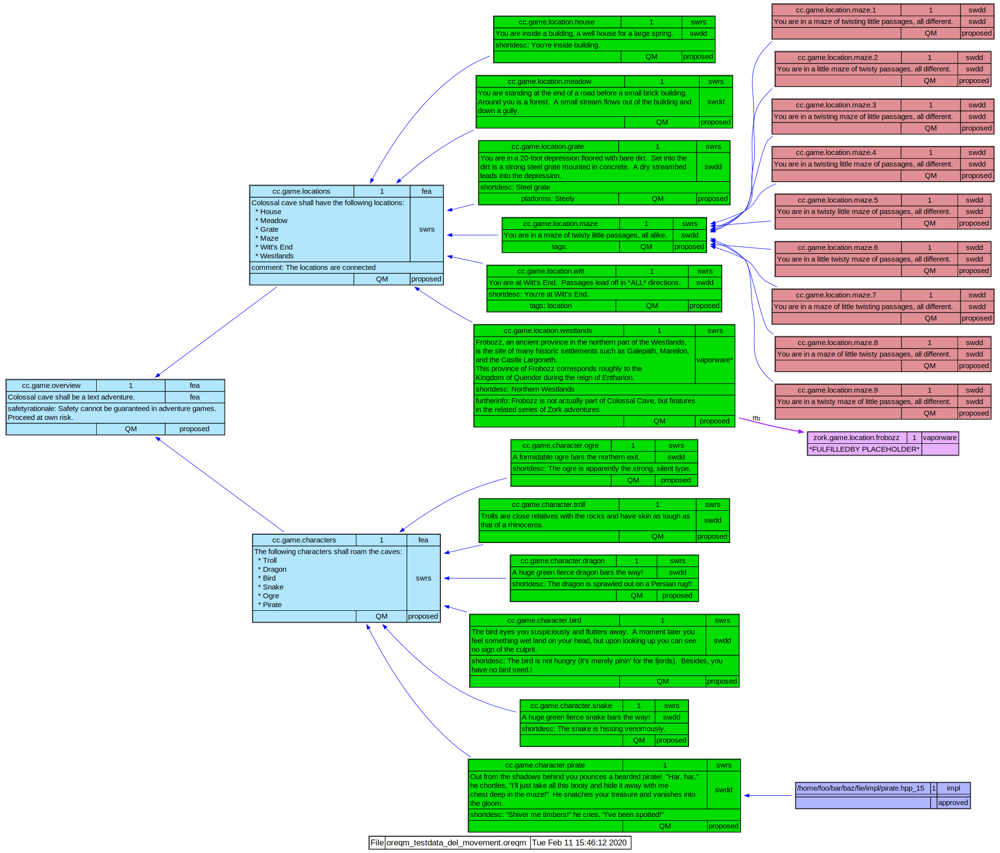

Introduction
=============

Visual ReqM2 is a browser app that generate visualizations of requirements hierarchies.

The input is an `.oreqm` file generated by ReqM2.

The output is a `.dot` graph, in the Graphviz 'dot' language.

It can visualize requirements from a single `.oreqm` file, or make a diagram representation of the differences between two `.oreqm` files.

Output
------
The app can generate output in `.svg`, `.png` and plain `.dot` format.

Further reading
---------------
There is a slide set in the documentation folder with further details

