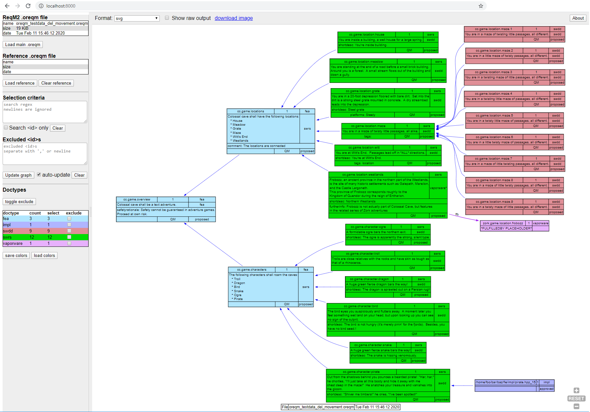

# Introduction

Visual ReqM2 is a browser app that generate visualizations of requirements hierarchies.

The input is an `.oreqm` file generated by ReqM2.

The browser displays a diagram created in the Graphviz 'dot' language.

It can visualize requirements from a single `.oreqm` file, or make a diagram representation of the differences between two `.oreqm` files.

It needs to be used from a http server. There are helper scripts to set up a simple python server.

# Search
When no search terms are defined, Visual ReqM2 will display all nodes. This may not always be a good strategy, as
some projects can have many thousands of requirements.
Visual ReqM2 will disable the 'auto-update' flag when there are more than 500 nodes.

## Filter Mechanisms
There are three main ways to filter requirements
 * by `doctype`
 * select nodes (and what is reachable)
 * exclude nodes (breaks reachability)

These will be explained below:

### Doctypes
Each requirement/node belong to a `doctype`. Each `doctype` is rendered in a box with a particular color.

The doctype table allows to disable display of certain ones. For example `impl` doctypes rarely have interesting information,
it is their presence that counts, so the user may choose not to clutter the diagram with such and exclude them.

The doctype table shows how many nodes of each are present in `.oreqm` and how many are currently displayed.

## Selecting nodes
The 'selection criteria' text box to the left accepts a **regular expression**. Nodes which match this expression will be shown and highlighted with a maroon outline. Furthermore all nodes reachable from these **selected** nodes will also be shown. All other nodes are left out.
The regular expression can be applied to the <id> only, or to a combined string. 

The combined string combines the raw text from xml tags in the order below, separated by newlines.

 * `<description>`
 * `<furtherinfo>`
 * `<rationale>`
 * `<safetyrationale>`
 * `<shortdesc>`
 * `<usecase>`
 * `<verifycrit>`
 * `<comment>`
 * `<tags>\<tag>*`
 * `<platform>`
 * `<id>`

**Note**: The `<id>` is deliberately the last item in this string. This means that a regex ending with '$' will match `<id>`.

**Note**: When doing comparisons of two `.oreqm` files, the `<id>` is prefixed with `rem:`, `chg:` and `new:` for removed, changed and new nodes.respectively.

Nodes can also be selected by right-clicking them and choosing 'Select' in the menu. This will update the regex in the search box.
Similarly an explicitly selected node and aso be de-selected from the right-click menu.
It is not possible to delselect nodes that were matched with anything but a specific `<id>$`.

**Note**: the Visual ReqM2 specific right-click menu only works i svg mode.

## Excluding nodes
The "Excluded \<id>s" text box contains full \<id>s if nodes that are excluded, one per line.

An excluded node if not shown, and the the node itself and anything beyond it is not reachable from selected nodes.
A right-click on a node opens a menu with the option to exclude the node. 

To un-exclude the node it is necessary to delete the relevant entry in the "Excluded \<id>s" box.

## Copy \<id> or other text from nodes to clipboard
A click on a node puts the \<id> on the clipboard.

Since the pan-zoom functionality uses mouse-drag, selection of text in nodes requires that either Alt or Ctrl is pressed down
when selecting text.

This is only possible when svg format is in use. 

## Update and auto-update
When loading an `.oreqm` file with less that 500 nodes, the full graph will be shown automatically. For larger graphs the 'auto-opdate' option
if turned off, and clicking the "Update graph" button is necessary.

The underlying graph generation tool, "Graphviz/viz.js" is limited in how big graphs it can render, and processing time also grows with graph size.

While the graph is beingn calculated a "WORKING" status is shown in the options bar. This happens in a worker thread, so selection criteria
can be updated while this is going on.

It is possible to enable "auto-update" regardless of the size of the graph, but responsiveness may slow.

## Comparing oreqm files
A reference `.oreqm` file can be loaded. This is expected to be a file older than the main one, in terms of what is categorized as new vs. removed.

Nodes which are new, changed or removed are shown with an outline around them in gree, orange or red. 

It is possible to select these nodes with regex expressions. A hidden prefix is added as described above.

# Output
The default output format is `.svg`. Output can also be generated in `.png` format.

In svg mode the "download image" link in options bar will download a `.svg` file.

For easy pasting of diagrams to chat tools and similar, it is also a possibility to switch to `.png` mode and right-click and "copy image".
This will be the browsers default right-click menu.

## How nodes are displayed
The text in specobjects is often written with various docbook/xml markup. `Graphviz` cannot render this markup, and readability
of the requirement suffers from the markup. Therefore heuristics are applied to remove the markup and implement simple versions of
list rendering. There is no attempt to reflow text, except from breaking up lines longer than a 110 characters.

## Colors and doctypes
Each doctype is assigned its own color. It is possible to load a color scheme, which is a simple JSON map from doctype name to hex RGB string("#RRGGBB").
Visual ReqM2 will generate pseudo-random unique colors for new doctypes.

The resulting palette can be downloaded, possibly modified, and uploaded. Visual ReqM2 stores the palette as a web storage in the browser, for persistence.

# Further reading

There is a slide set in the documentation folder with further details

## example diagram

